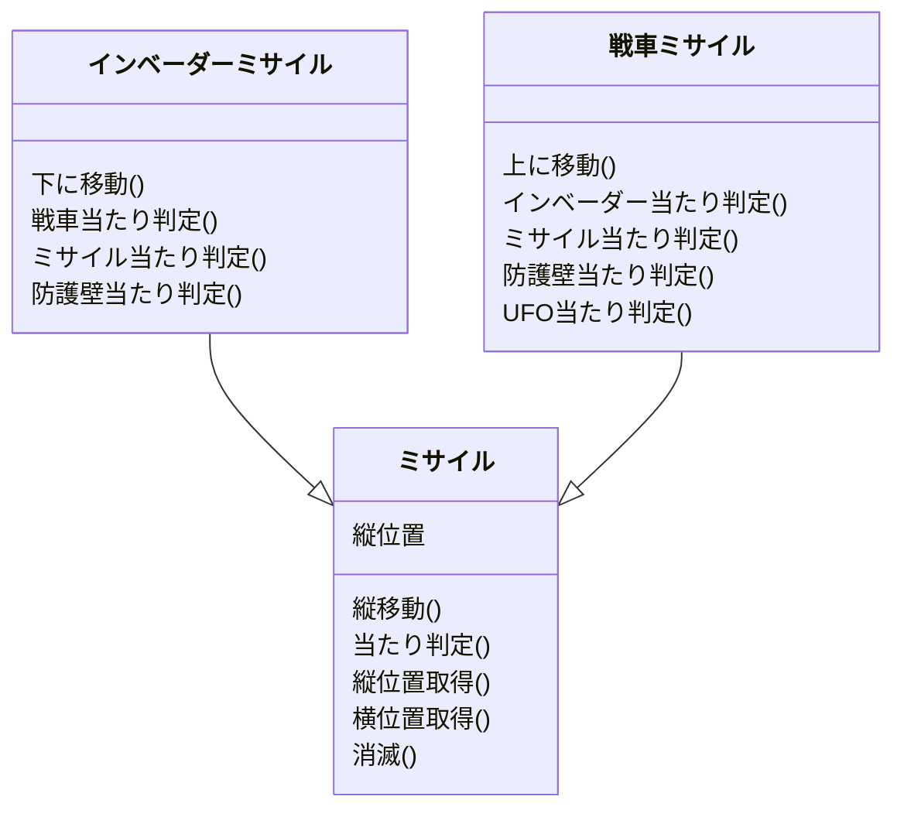

```mermaid
classDiagram
インベーダーミサイル --|> ミサイル
戦車ミサイル --|> ミサイル
ミサイル : 縦位置
ミサイル : 縦移動 ()
ミサイル : 当たり判定 ()
ミサイル : 縦位置取得 ()
ミサイル : 横位置取得 ()
ミサイル : 消滅 ()
インベーダーミサイル : 下に移動 ()
インベーダーミサイル : 戦車当たり判定 ()
インベーダーミサイル : ミサイル当たり判定 ()
インベーダーミサイル : 防護壁当たり判定 ()
戦車ミサイル : 上に移動 ()
戦車ミサイル : インベーダー当たり判定 ()
戦車ミサイル : ミサイル当たり判定 ()
戦車ミサイル : 防護壁当たり判定 ()
戦車ミサイル : UFO当たり判定 ()
```
